# Computer Games & Virtual Reality (2023) - Quest Explorer

### **Project Overview**

This project is a team assignment for the "Computer Games" and "Virtual Reality" courses, offered in the 7th semester of the 2023 academic year at the University of Piraeus, Department of Informatics. The project is Unity 3D game with basic features, such as an entry screen, in-game menus, and HUD elements. The game simulates the daily life of a farmer named Alex.

## Course Information

- **Institution:** University of Piraeus
- **Department:** Department of Informatics
- **Courses:** Computer Games & Virtual Reality (2023)
- **Semester:** 7th

## Technologies Used

- C#
- Unity

### **Game Description**
The game is set in 1995, in Texas, and follows a day in the life of a farmer, Alex, as he deals with daily challenges on his farm. The game features three different maps representing different stages of Alex's journey to fix a problem on his farm. Along the way, Alex meets friends and family who help him overcome obstacles and achieve his goals. The game offers a warm, nostalgic experience, touching on themes such as friendship and connection with the past.

### **Development Phases**

**Analysis**:
- The team decided early on the basic storyline of the game.
- After brainstorming, the story chosen was "a day in the life of a farmer named Alex."
- The game environment was divided into three distinct areas: 
  1. **Farm**: The starting and ending environment where Alex interacts with his surroundings.
  2. **Forest**: The transitional environment between the Farm and the City.
  3. **City**: The environment where Alex resolves the main issue and returns to the farm.

**Design**:
- **Unity Version**: 2022.3.13f1
- **Farm**: Designed with terrain, roads connecting farm structures, and realistic elements like trees, fields, greenhouses, and farm vehicles.
- **Forest**: Includes a road connecting the farm to the city, with rivers and a waterfall.
- **City**: Features roads and potential locations for houses.

**Implementation**:
- Added realistic elements such as trees, mountains, rivers, houses, and cars to the terrains.
- **Farm**: Completed with interactive elements like automatic irrigation, moving NPCs, and sounds.
- **Forest**: Includes nature sounds, water and air effects, moving cars with NPCs, and predefined paths.
- **City**: Added moving cars and NPCs with predefined paths using NavMeshPath, and unique interactions when the player approaches or looks at certain NPCs using RayCast.

### **Final Environments**
- **Farm Pictures**
  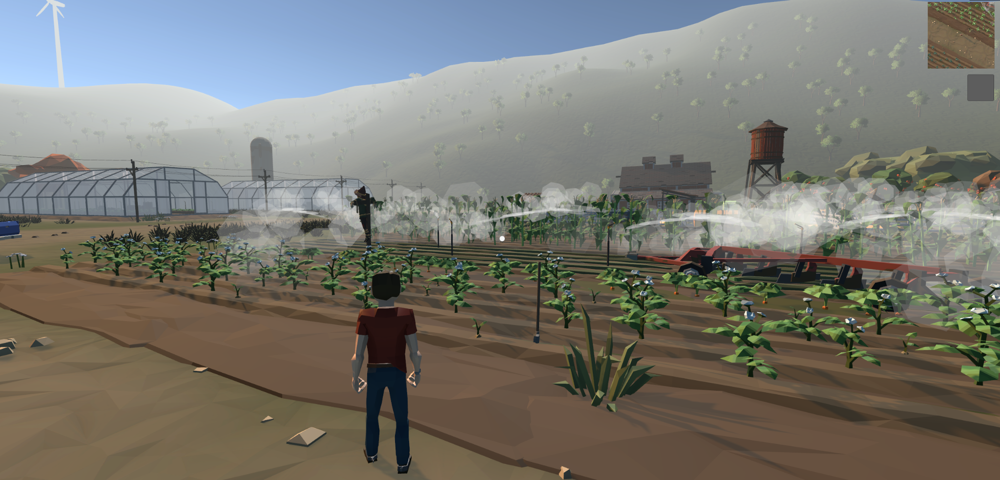
  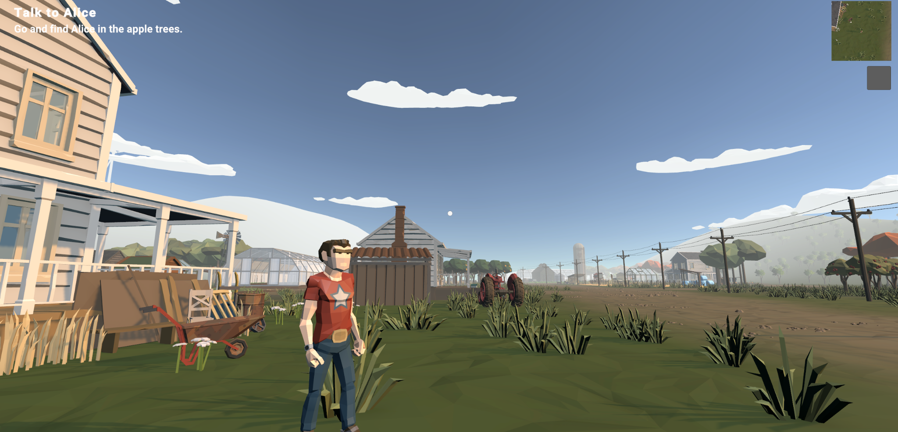
  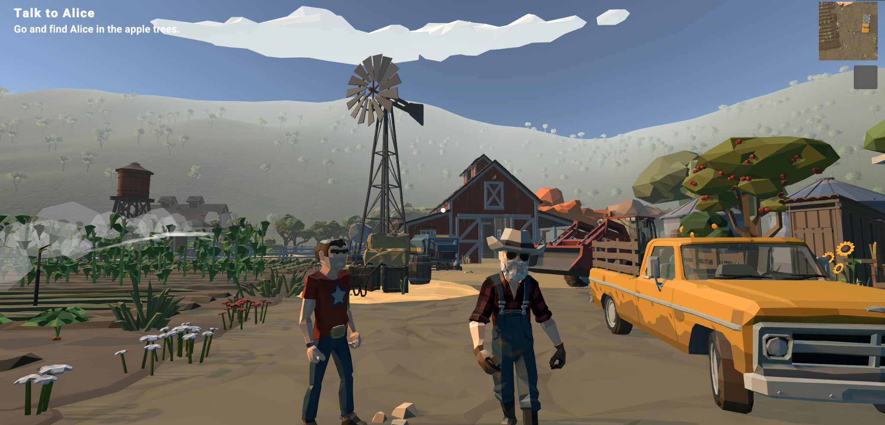
  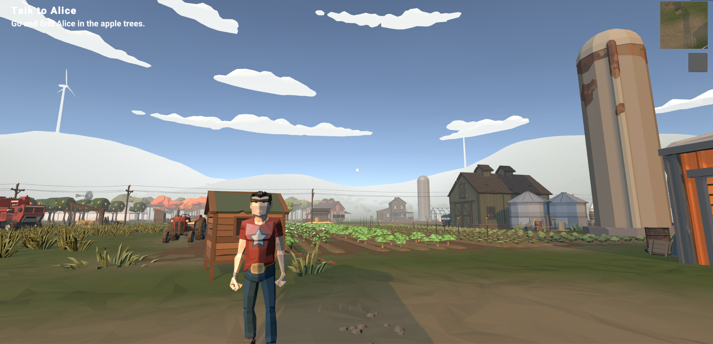
- **Forest Pictures**
  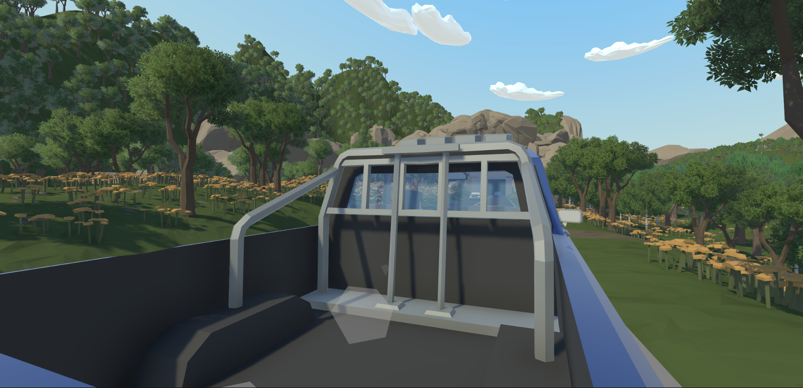
  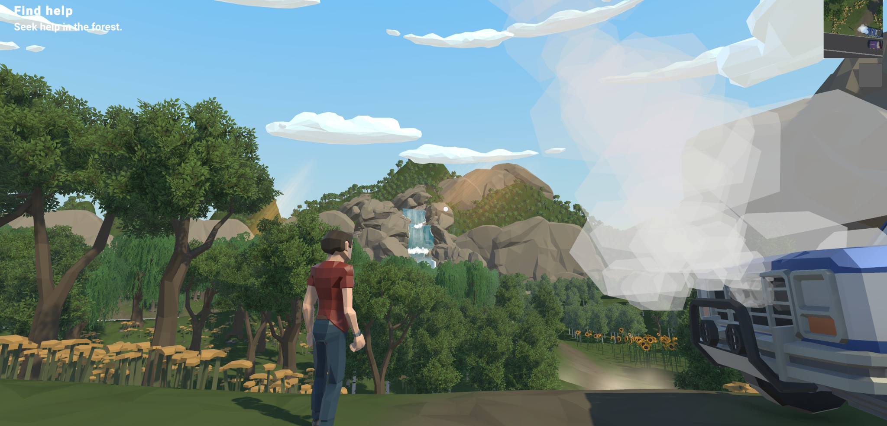
  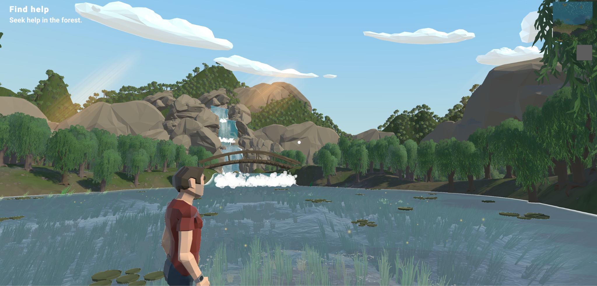
  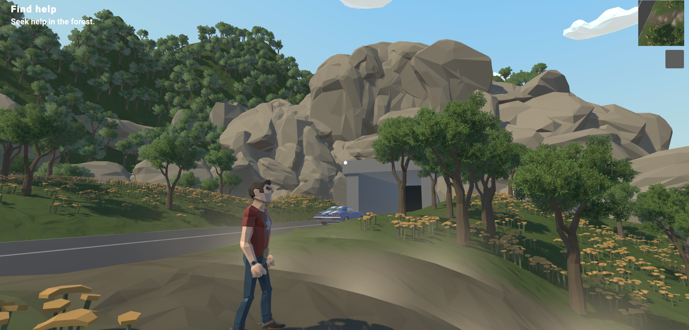
  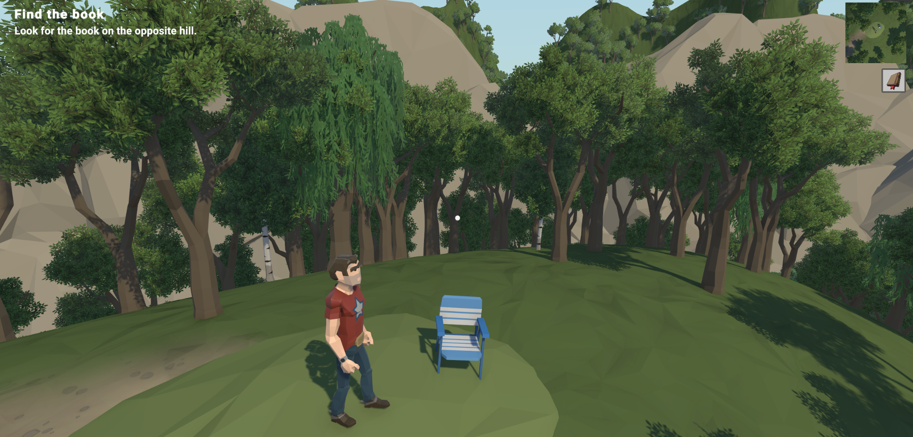
  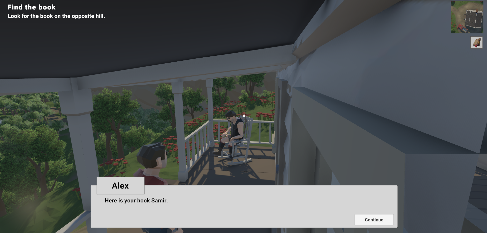
- **City Pictures**
  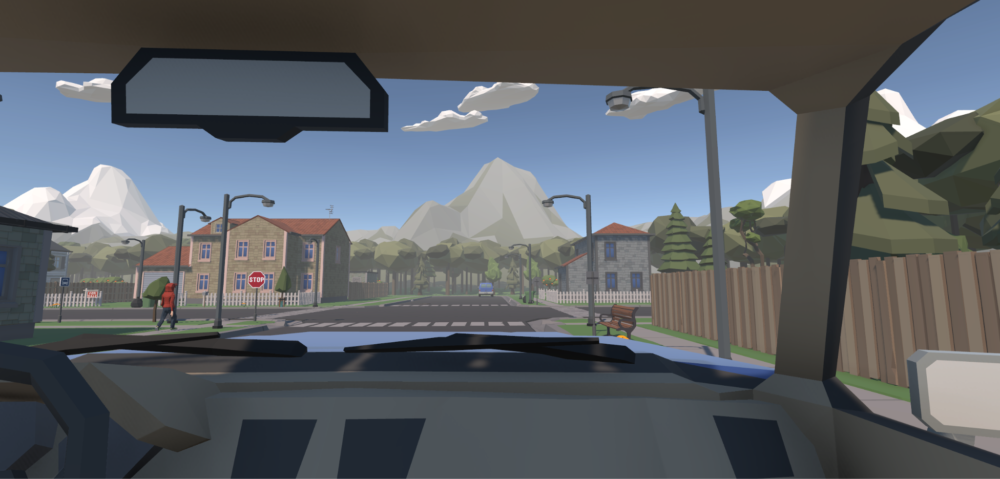
  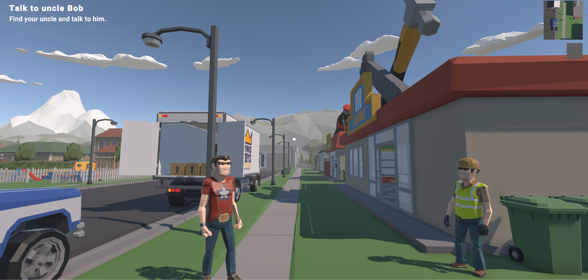
  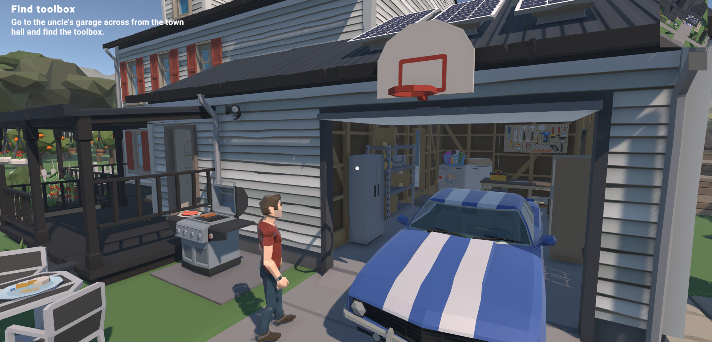
  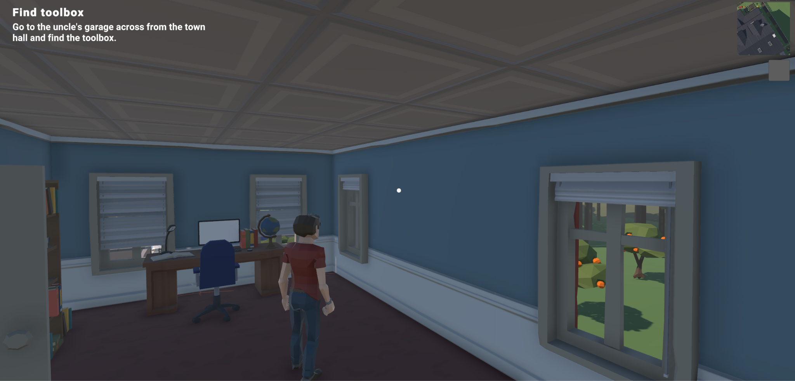
## Contributors

<table>
  <tr>
    <td align="center"><a href="https://github.com/thkox"> <b>Theodoros Koxanoglou</b></a> </td>
    <td align="center"><a href="https://github.com/ApostolisSiampanis"> <b>Apostolis Siampanis</b></a> </td>
    <td align="center"><a href="https://github.com/dimitrisstyl7"> <b>Dimitris Stylianou</b></a> </td>
    <td align="center"><a href="https://github.com/anthonyrouss"> <b>Anthony Roussos</b></a> </td>
  </tr>
</table>

## License

This project is licensed under the MIT License - see the [LICENSE](./LICENSE) file for details.
